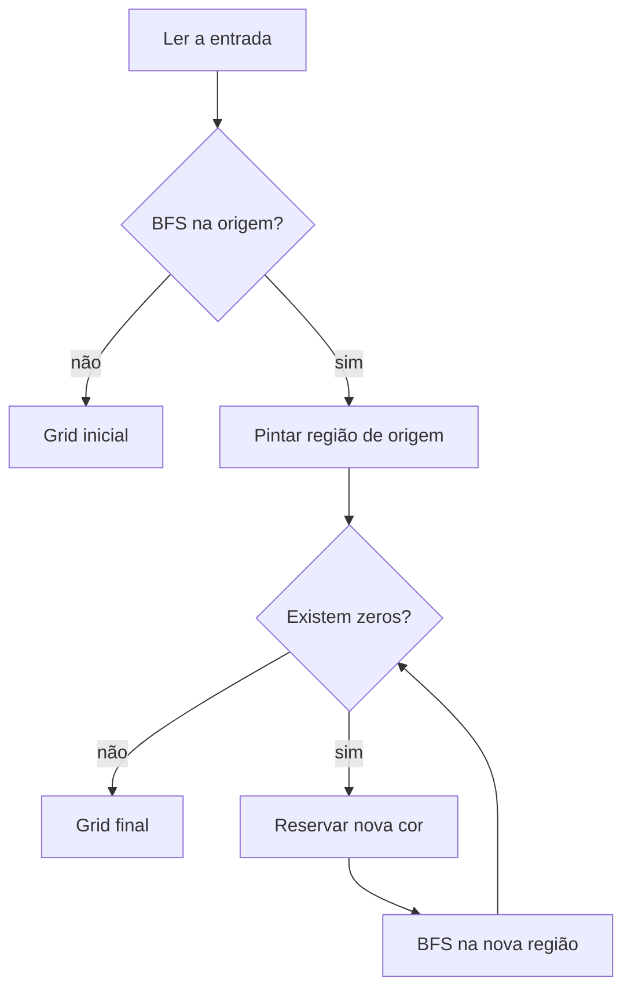

# Projeto – Algoritmo Flood Fill Multi-Regiões


## Descrição do Projeto

O **Algoritmo Flood Fill Multi-Regiões** identifica e colore, de forma automática, todas as áreas navegáveis de um grid 2D, atribuindo uma cor distinta para cada componente conexa. A solução foi projetada para apoiar robôs autônomos durante o mapeamento inicial de um terreno desconhecido, respeitando obstáculos e regiões previamente demarcadas.

**Principais objetivos:**

1. Receber um grid `n x m` contendo células livres (`0`), obstáculos (`1`) e áreas já coloridas (`>=2`).
2. Iniciar o preenchimento a partir de uma célula informada, expandindo ortogonalmente por células navegáveis.
3. Localizar automaticamente as próximas regiões livres e repetir o processo até que não existam mais `0` no grid.

## Lógica do Algoritmo Implementado

Trecho central (arquivo `floodfill.py`):

```python
def flood_fill_all(grid, start):
	used_colors = {value for row in grid for value in row if value >= 2}
	next_candidate = 2

	def fill_and_count(coord):
		nonlocal next_candidate
		if grid[coord[0]][coord[1]] != 0:
			return 0
		color, next_candidate = reserve_color(used_colors, next_candidate)
		return paint_region(grid, coord, color)

	regions = 0
	if fill_and_count(start):
		regions += 1
	for i, row in enumerate(grid):
		for j, value in enumerate(row):
			if value == 0 and fill_and_count((i, j)):
				regions += 1
	return grid, regions
```

Linha a linha:

1. **Linhas 2-3**: Identificam cores já usadas para evitar colisões e definem o próximo candidato (mínimo 2).
2. **Linhas 5-12**: Definem `fill_and_count`, que só dispara uma pintura se a célula ainda for `0`. A função reserva uma cor livre e delega a pintura para `paint_region`, que faz a busca em largura.
3. **Linhas 14-15**: Pintam a região que contém o ponto inicial, caso ainda esteja livre.
4. **Linhas 16-19**: Fazem uma varredura completa em busca de novos zeros. Cada vez que `fill_and_count` retorna positivo, incrementamos o contador de regiões.
5. **Linha 20**: Retorna o grid atualizado e o número de regiões coloridas.

Esse fluxo combina a estratégia “preencha primeiro onde o robô está” com uma busca posterior por áreas ainda não exploradas, garantindo cobertura total do mapa.

### Visualização da Estrutura Hierárquica

```
Região inicial ──► BFS (fila) ──► marca vizinhos livres
						   │
						   └──► Obstáculos e cores ≥2 bloqueiam a propagação

Após BFS: scan linha/coluna ──► encontrou 0? ──► reserva nova cor ──► BFS novamente
```

Essa visão ilustra como a solução alterna entre **explorar** (BFS) e **varrer** (scan sequencial) até esgotar os espaços navegáveis.

## Estrutura do Repositório

- `floodfill.py`: implementação completa do algoritmo e CLI simples via entrada padrão.
- `examples/`: arquivos de teste prontos (por exemplo, `examples/basic.txt`).
- `assets/`: espaço reservado para diagramas ou imagens explicativas (adicione conforme necessário para relatórios).

## Como Executar o Projeto

### Pré-requisitos

- Python 3.10 ou superior.
- Nenhuma dependência externa.

### Passos para Execução

1. (Opcional) Criar ambiente virtual:

```bash
python -m venv .venv
source .venv/bin/activate
```

2. Executar o programa principal com um arquivo de entrada:

```bash
python floodfill.py < examples/basic.txt
```

3. Saída típica:

```
2 2 1 3 3 3
2 1 1 3 1 3
2 2 1 3 1 3
1 1 1 1 1 1
4 4 1 5 5 5
#regioes=4
```

O grid colorido aparece em `stdout`, enquanto `#regioes=<valor>` é impresso em `stderr`.

## Interface Gráfica Interativa

Para observar o preenchimento acontecendo passo a passo e testar configurações aleatórias, utilize `visualizer.py`, que oferece:

- Geração automática de grids com controle de proporção de obstáculos (slider).
- Seleção dinâmica de linhas/colunas e velocidade de animação.
- Limite de 10x10 no modo gráfico (mantém as células legíveis e animação fluida).
- Escolha da célula inicial por clique (ou seleção aleatória automática).
- Visualização em tempo real das regiões sendo coloridas e contagem final de componentes.
- Painel dedicado exibindo as cores utilizadas em cada região durante a animação.

### Executando

```bash
python visualizer.py
```

Controles principais:

- **Novo grid**: respeita as dimensões/percentual configurados e escolhe uma célula inicial navegável.
- **Iniciar preenchimento**: dispara a animação do Flood Fill multi-regiões.
- **Clique no grid**: reposiciona o ponto inicial (apenas em células livres, antes de começar a animação).

Caso esteja em um ambiente headless, utilize apenas o modo CLI (`floodfill.py`).

## Formato da Entrada

```
n m
<n linhas com m inteiros>
x y
```

- `n, m`: dimensões do grid.
- cada célula recebe `0`, `1` ou `>=2`.
- `x y`: coordenadas zero-based do ponto inicial.
- Linha em branco ou com `#` é ignorada, permitindo comentários.

## Explicação Detalhada do Flood Fill

1. **Ponto inicial**: é validado e, se livre, inicia o preenchimento.
2. **BFS**: utilizamos uma fila (`collections.deque`). A cada célula removida, examinamos quatro vizinhos (norte, sul, leste, oeste).
3. **Coloração incremental**: a função `reserve_color` garante que a cor a ser usada não conflite com valores existentes.
4. **Obstáculos**: células com `1` nunca entram na fila; valores `>=2` são tratados como paredes lógicas.
5. **Loop global**: depois que a fila esvazia, percorremos todo o grid para localizar novos zeros e repetimos o processo com outra cor.

Esse método evita trabalho redundante e mantém os contornos de cada região perfeitamente delimitados.

## Exemplos de Entrada e Saída

### Exemplo 1 – Grade 4x5

```
Grid inicial:
0 0 1 0 0
0 1 1 0 0
0 0 1 1 1
1 1 0 0 0

Coordenadas iniciais: 0 0
```

```
Grid preenchido:
2 2 1 3 3
2 1 1 3 3
2 2 1 1 1
1 1 4 4 4

#regioes=3
```

### Exemplo 2 – Grade 4x5 com gargalo central

```
Grid inicial:
0 1 0 0 1
0 1 0 0 1
0 1 1 1 1
0 0 0 1 0

Coordenadas iniciais: 0 2
```

```
Grid preenchido:
3 1 2 2 1
3 1 2 2 1
3 1 1 1 1
3 3 3 1 4

#regioes=3
```

### Exemplo 3 – Arquivo `examples/basic.txt`

```
5 6
0 0 1 0 0 0
0 1 1 0 1 0
0 0 1 0 1 0
1 1 1 1 1 1
0 0 1 0 0 0
0 0
```

Resultado após execução:

```
2 2 1 3 3 3
2 1 1 3 1 3
2 2 1 3 1 3
1 1 1 1 1 1
4 4 1 5 5 5

#regioes=4
```

## Análise de Complexidade

### Contagem de Operações

- Cada célula é enfileirada e desenfileirada no máximo uma vez.
- Cada aresta (vizinho ortogonal) é checada apenas quando a célula correspondente é processada.

Portanto, o número de operações é proporcional ao número de células `n * m`, resultando em **complexidade temporal O(n·m)**.

### Complexidade Espacial

- A fila armazena, no pior caso, todas as células de uma região, logo o espaço adicional é **O(t)**, onde `t` é o tamanho da maior região.
- A varredura completa consome apenas espaço constante extra.

### Comparação com Abordagens Ingênuas

| Abordagem                     | Temporal | Comparações/visitas           | Espacial |
|------------------------------|----------|-------------------------------|----------|
| DFS/BFS por região (implementada) | O(n·m)   | Cada célula visitada 1 vez      | O(t)     |
| Varredura ingênua recomeçando a BFS sempre do topo | O(n·m·k) | Reprocessa regiões já coloridas | O(t)     |

`k` representa o número de regiões. A abordagem atual evita reinicializações desnecessárias.

## Fluxograma Simplificado



## Autores

- **Nome**: Arthur Kramberger, Lucas Cerqueira, Helio Ernesto, Mateus Faissal
- **Disciplina**: Fundamentos de Projeto e Análise de Algoritmos
- **Data**: Novembro de 2025
